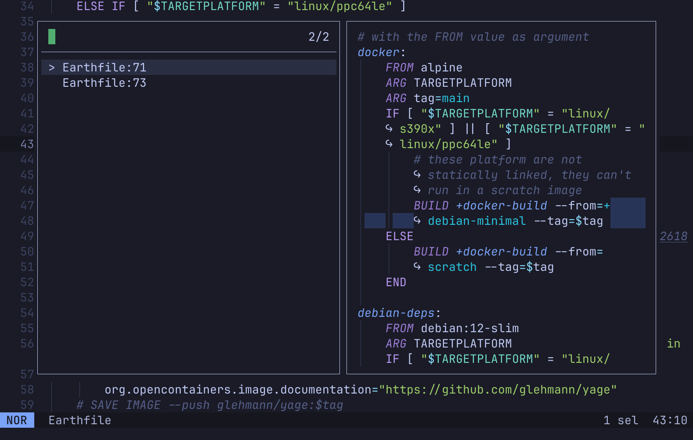

# earthlyls: earthly language server

A fast language server for [earthly].

## Installation

### From binary package

Go to the [earthlyls release page](https://github.com/glehmann/earthlyls/releases), download the binary package for
your OS, extract it and copy the `earthlyls` (`earthlyls.exe` on Windows) in a directory in your `PATH` — for example
`~/.local/bin/`.

### From source package

Just run:

~~~sh
cargo install earthlyls
~~~

### From sources

Clone the earthlyls repository and run:

~~~sh
cargo install --path .
~~~

## Text editor configuration

### helix

Helix from the `main` branch comes preconfigured with earthlyls support. Just enjoy!

For older versions, add this in your `languages.toml`:

~~~toml
[language-server]
earthlyls = { command = "earthlyls" }

[[language]]
name = "earthfile"
scope = "source.earthfile"
injection-regex = "earthfile"
roots = ["Earthfile"]
file-types = [
  { glob = "Earthfile" },
]
comment-token = "#"
indent = { tab-width = 2, unit = "  " }
language-servers = ["earthlyls"]

[[grammar]]
name = "earthfile"
source = { git = "https://github.com/glehmann/tree-sitter-earthfile", rev = "2a6ab191f5f962562e495a818aa4e7f45f8a556a" }
~~~

Optionally run `hx --grammar build` to update your tree-sitter libraries and get the Earthfile syntax highlighting.

## Performance

How fast?

On a macbook air m1, `earthlyls` loads the 178 `Earthfile` in the `earthly` repository — approximately 10000 lines —
in 51.95ms. A simple "go to definition" runs under a millisecond. A "go to reference", which searchs in all the
`Earthfile` in the workspace, runs in 18.61ms.

## License

`earthlyls` is distributed under the terms of the MIT license.

See [LICENSE](LICENSE) for details.

[earthly]:https://earthly.dev/

