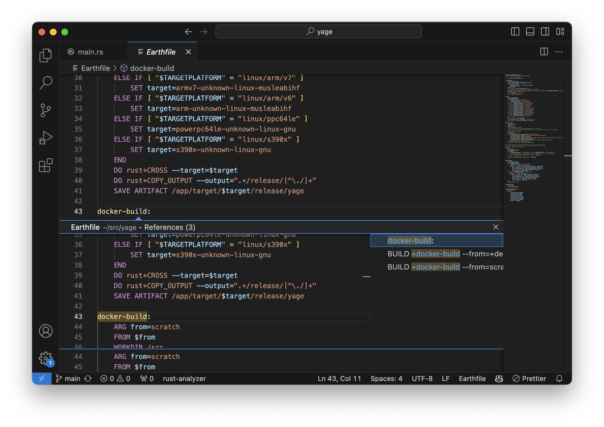

# earthlyls: earthly language server

A fast language server for [earthly].

`earthlyls` supports the following LSP features:

* hover
* goto definition
* goto declaration
* references
* incremental document update

## Performance

How fast?

On a macbook air m1, `earthlyls` loads the 178 `Earthfile` in the `earthly` repository — approximately 10000 lines —
in 51.95ms. A simple "go to definition" runs under a millisecond. A "go to reference", which searchs in all the
`Earthfile` in the workspace, runs in 18.61ms.

## License

`earthlyls` is distributed under the terms of the MIT license.

See [LICENSE](LICENSE) for details.

[earthly]:https://earthly.dev/
